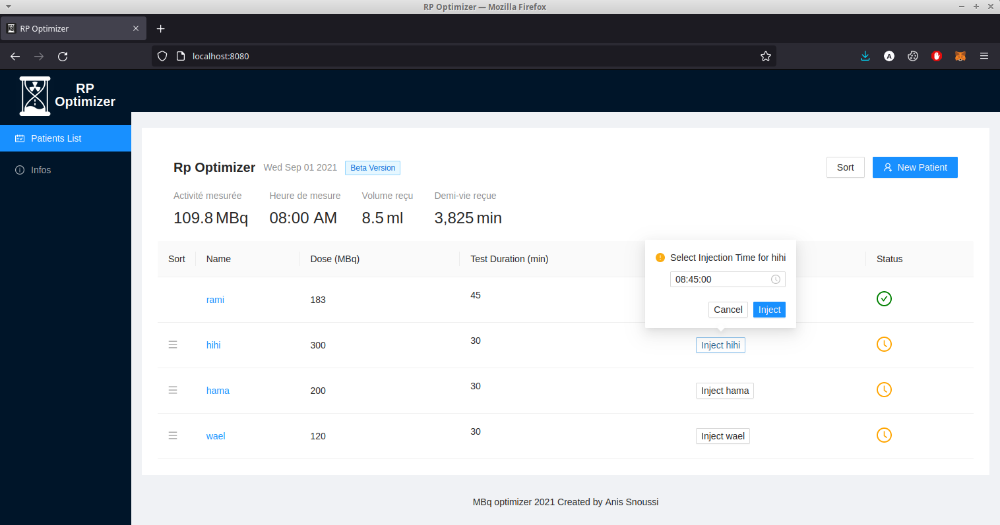

<h1> Rp Optimizer </h1>
 
Rp Optimizer (short for Radiopharmaceuticals Optimizer) is an open source web app used to make the use of Radioactive pharmaceuticals used in the detection of cancerous cells more efficient during PET scans.

This app was designed and built with one goal in mind : **_use IT to make an impact and give back to the community as much as possible._**

## Case Study
The Sahloul University Hospital ,being the first Hospital to make use of this app, had a great deal of impact on the development process. In fact this app was built solely for Sahloul University Hospital but then I decided to open source it.

At said hospital, the PET (Positron emission tomography) unit used **fluor 18 marked fluorodeoxyglucose** who's radioactivity allowed the PET camera to visualise the cancerous cells during the scan.

This pharmaceutical is both expensive and his radioactivity decrease rapidly (half life of 110 min).

On the scan day, the PET unit receives the pharmaceutical and it has to decide on how to decide on an optimal way to divide it between several patients (each with different needs in term of : scan time & required radioactivity needed for the scan).

In comes our app whose purpose is to effectively and efficiently order patients during a PET scan given an initial state, and also to show usefull statistics and predictions that are crucial for the PET machine operator.

## Screenshot

