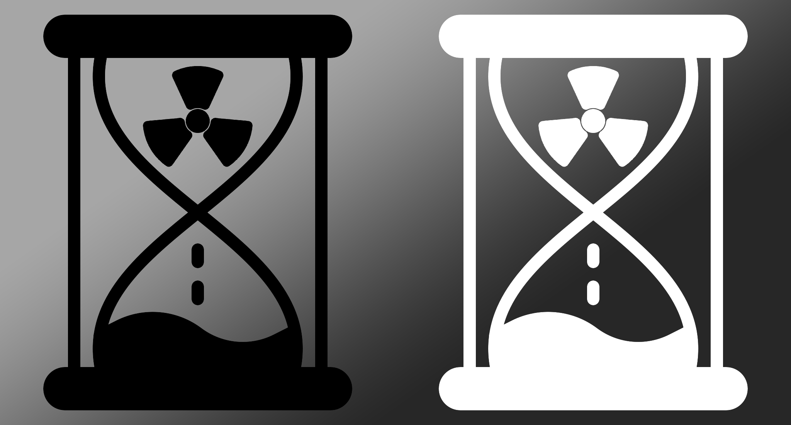
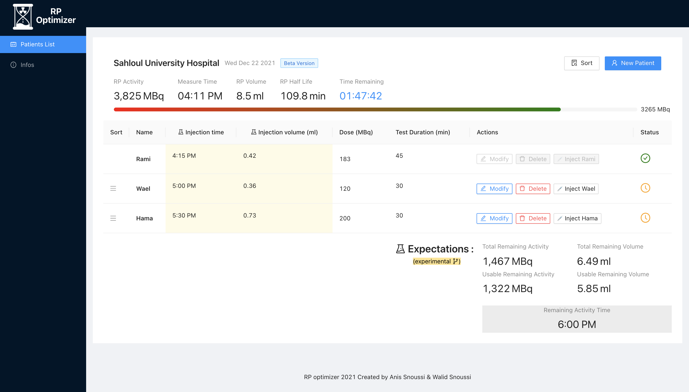

<h1  align="center"> Rp Optimizer </h1>

<p align="center">
    <a href="#" alt="React">
        </a>
    <a href="#" alt="Ant-Design">
        </a>
    <a href="#" alt="Vercel">
        </a>
    <a href="#" alt="Cypress">
        </a>

</p>

---
## 🚧 Under Maintenance :
The project is undergoing a **HUGE** code refactoring and optimization ! 
>This was just a POC, experimental code glued together from various bursts of motivation I had at different react skill levels, there is code with class components, functional components and even code translated directly from the previous python version.

---

## 🏠 [Homepage](https://rpo-ansnoussi.vercel.app)

## Description

**Description** : Rp Optimizer (short for Radiopharmaceuticals Optimizer) is an open source web app used to make the use of Radioactive pharmaceuticals used in the detection of cancerous cells more efficient during PET scans.


<h3> Case Study </h3>

The Sahloul University Hospital ,being the first Hospital to make use of this app, had a great deal of impact on the development process. In fact this app was built solely for Sahloul University Hospital but then I decided to open source it.

At said hospital, the PET (Positron Emission Tomography) unit used **fluor 18 marked fluorodeoxyglucose** who's radioactivity allowed the PET camera to visualise the cancerous cells during the scan.

This pharmaceutical is both expensive and his radioactivity decrease rapidly (half life of 110 min).

On the scan day, the PET unit receives the pharmaceutical and it has to decide on an optimal way to divide it between several patients (each with different needs in term of : scan time & required radioactivity needed for the scan).

In comes our app whose purpose is to effectively and efficiently order patients during a PET scan given an initial state, and also to show usefull statistics and predictions that are crucial for the PET machine operator.

## Screenshot



## Project setup

The current project is using the following toolkit:

- [Email.js](https://www.emailjs.com/) : for sending user feedback via email.
- [Sentry](https://sentry.io) : for monitoring app health in the production environment and loggig errors.
- [Amplitude](https://amplitude.com) : for collecting business metrics and displaying them in a nice comprehensive dashboard (example : number of patients / day).
- [Vercel](https://vercel.com) : for deploying the app to main domain in the production environment, and each commit to a temporary url in the preview environment.
- [Cypress Dashboard](https://vercel.com) : for running e2e tests in the CI pipeline and uploading video of the tests to an online dashboard.

## Installation

Use the node package manager [npm](https://www.npmjs.com/) to install the RP-Optimizer project and run it.

```
cd app && npm install;
```

## Usage

```
npm start
```

## Run tests

```
npm run test
```

## 🏝️ Codesandbox
This is a codesandbox to test the sorting / prediction logic in isolation : [Link](https://codesandbox.io/s/rpo-sandbox-29y7qv)

## 🤝 Contributing

Pull requests are welcome. For major changes, please open an issue first to discuss what you would like to change.
Please make sure to update tests as appropriate.

#### Typical contributing process

1. A change is commited to the `dev` branch.
2. Vercel detects the commit and deploys to a temporary url that is accessible to test the changes live.
3. I create a PR to merge with `master` branch
4. Cypress detects the PR, runs the e2e tests and uploads a video of the execution the Cypress dashboard, and then replies to the PR with the test results.
5. Now, that Branch protection rules are satisfied, I can successfully merge the PR.
6. Vercel detects the merge and deploys the project to main url.

**PS**: Branch protection rules are :

1. Require a pull request before merging to master
2. Require status checks to pass before merging (the Cypress e2e tests)

## 📝 License

[Apache License](./LICENSE)
